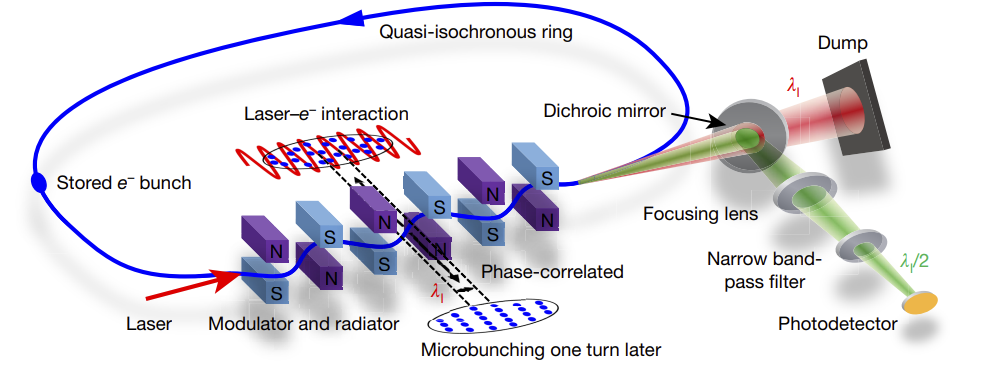
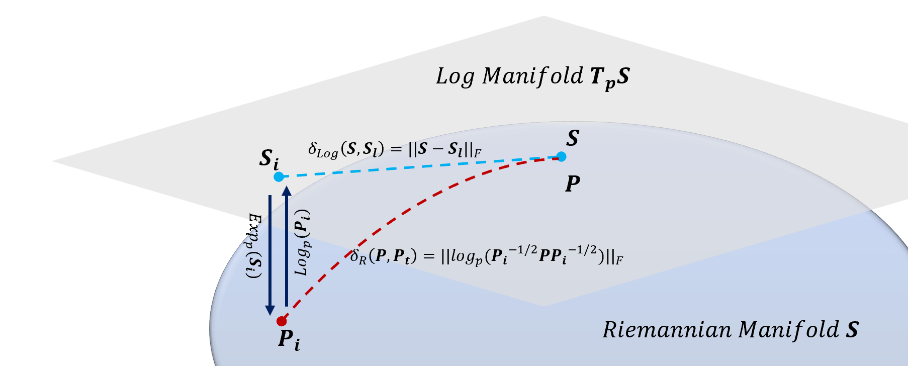
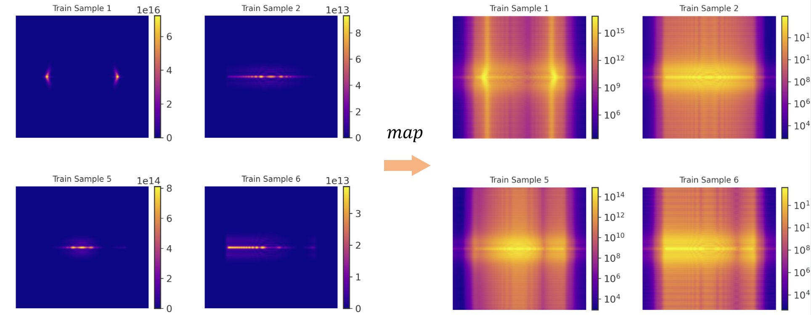
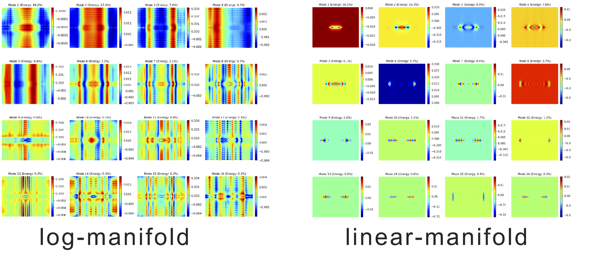
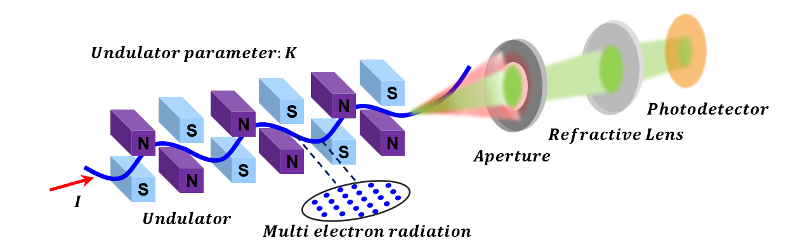
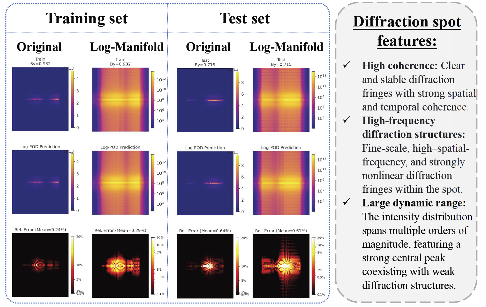

# XRayLogSurrogate
**Real-Time X-ray Beamline Surrogate Modeling via a Physics-Informed Log-Manifold Learning Framework**
<!---
[](https://www.ipac26.org/)
--->
[](https://opensource.org/licenses/MIT)
[](https://www.tsinghua.edu.cn/en/)

<!---
> **Supplementary Material for IPAC'26 Contribution**  
> *"End-to-End Surrogate Modeling of Undulator Radiation Transport in X-ray Beamlines: Accurately Predicting High-Dynamic-Range Focal Spots via Log-Manifold Learning"*
--->
---
## Steady-State Microbunching (SSMB)

**The Steady-State Microbunching (SSMB)** scheme—first experimentally demonstrated in the Nature paper **“Coherent millimetre-wave emission from steady-state microbunching in a storage ring” (Nature 590, 576–580, 2021)**—represents one of the most promising routes toward **high-repetition-rate, high-coherence radiation sources**.

SSMB enables:

- continuous-wave microbunching of electron beams

- high-brightness radiation at high repetition rate

- compact, energy-efficient light source design

However, to support beamline tuning, online diagnostics, and **real-time photon delivery optimization**, fast and accurate modeling of the entire radiation transport chain is essential, including:

- Undulator radiation generation

- Wave-optical beamline propagation

- High-dynamic-range focal-spot prediction

However, **full SRW simulations of complete X-ray beamlines** are computationally prohibitive, often taking minutes to hours per configuration—far too slow for real-time optimization loops in future SSMB-based facilities.


<p align="center">  <br> <em><b>Figure 1:</b> SSMB radiation → undulator → X-ray beamline → focusing optics. </em> </p>

---

##  XRayLogSurrogate: A Physics-Informed Log-Manifold Surrogate
To address the following bottleneck, we present **XRayLogSurrogate**, **the first end-to-end log-manifold surrogate model** capable of reproducing entire wave-optical propagation of undulator radiation through complex X-ray beamlines with **sub-percent accuracy** across extreme **dynamic range** of focal spot distributions in intensity.

- **The Challenge:** Wave-optical simulation of undulator radiation through entire beamlines is computationally prohibitive, hindering real-time parameter optimization.The high-frequency diffraction structures and extreme dynamic range of focal spot distributions pose significant challenges to conventional surrogate models.
- **The Innovation:** We propose the **first log-manifold surrogate** modeling framework that represents intensity distributions in logarithmic space, converting highly nonlinear diffraction structures into low-rank learnable manifolds.Combined with **physics-informed constraints**, the model achieves high accuracy with minimal training samples and generalizes well across beamline configurations.
- **The Result:** The proposed model achieves <1% relative error across the full dynamic range, faithfully reconstructing fine diffraction fringes. Single prediction takes only milliseconds, yielding a **$>10^4$ speedup** over SRW simulation and enabling real-time surrogate-based beamline optimization.

### Main Contributions
- **Physics-Informed & Log-Manifold-Learning-Based Surrogate Modeling Framework:** We propose the first diffraction spot prediction framework based on Physics-Informed and log-manifold learning, enabling efficient extraction of undulator radiation features with high coherence, high spatial frequencies, and large dynamic range.
- **Efficient Prediction via Proper Orthogonal Decomposition:** The log-manifold representation maps highly nonlinear diffraction structures of undulator radiation onto a learnable low-rank manifold, enabling accurate modeling with limited data and robust generalization across beamline configurations.
- **Enabling Real-Time Digital Twins and Online Optimization :** The proposed method provides an efficient and practical digital twin modeling approach for fourth-generation light source beamlines, enabling online parameter optimization, rapid parameter scanning, and virtual diagnostics.


---


##  Methodology: Log-Manifold Learning

### 1. The Logarithmic Mapping
Standard neural networks struggle with the extreme dynamic range of X-ray focal spots. We convert the intensity field $I(x,y)$ into a logarithmic manifold:

$$
L(x,y) = \log_{10}(I(x,y) + \epsilon), \quad  \epsilon\ll 1
$$

This logarithmic mapping dramatically linearizes the otherwise severely nonlinear diffraction fringes, yielding a **low-rank, highly learnable** manifold in log-space (see visualization below).


<p align="center">
  
  <br>
  <em><b>Figure 2:</b> Schematic of the low-dimensional manifold structure of synchrotron radiation
diffraction patterns under log-manifold mapping</em>
</p>


<p align="center">
  
  <br>
  <em><b>Figure 3:</b> Intensity focal spot in linear (left) and log₁₀ (right) scale. The logarithmic representation dramatically improves the learnability of fringes.</em>
</p>

### 2. Log-Manifold POD

To exploit the dramatically improved linearity revealed by the logarithmic mapping, we perform Proper Orthogonal Decomposition (POD) **exclusively in the log₁₀-intensity domain**.  

Let $\{L_n(x,y)\}_{n=1}^{N_{\text{sample}}}$ denote the set of $N_{\text{sample}}$ centered log-intensity snapshots. The POD yields an optimal (in $L^2$ sense) orthonormal basis $\{\phi_k(x,y)\}_{k=1}^{r}$ and corresponding coefficients $\{a_{n,k}\}_{n,k}$ such that

$$
L_n(x,y) \approx \bar{L}(x,y) + \sum_{k=1}^{r} a_{n,k}\,\phi_k(x,y)\phi_k^{T}(x,y),
\quad r\ll N_{\text{pixel}},
$$

where $\bar{L}(x,y)$ is the ensemble mean and $r$ is the retained rank.

In the present case, **>99.99 % of the log-space energy is captured with only 58 modes** (versus more than 200 modes required in linear intensity space), confirming that the log-manifold is intrinsically low-rank.

<p align="center">
  
  <br>
  <b>Figure 4:</b> POD modes of the log-manifold (left) and linear-manifold (right). The comparison clearly demonstrates that the log-manifold captures more pronounced non-linear characteristics.
</p>


### 3. Physics-Informed Residual Surrogate Network

The POD coefficients $a_k$ are predicted by a compact yet highly expressive **physics-informed residual neural network** that directly ingests upstream beamline parameters (undulator deflection parameter $K$, electron-beam emittance $\epsilon_{x,y}$, energy spread, mirror figure errors, etc.).

Key architectural and training enhancements that dramatically boost generalization, robustness, and physical fidelity:

- **Deep residual blocks** (8 layers) with SiLU activation and dropout for stable training of highly nonlinear mappings  
- **Energy-weighted coefficient loss** that prioritizes physically dominant low-order modes while preventing neglect of high-frequency diffraction details  
- **Explicit $L^2$-normalization constraint** on predicted coefficients to enforce conservation of log-space energy  
- **Physics-informed regularization terms** (undulator resonance condition + upstream wavefront curvature consistency) injected during training  
- **Input noise injection** on beam parameters to emulate realistic machine jitter and further enhance out-of-distribution generalization  

The combination of these ingredients yields **sub-percent relative error even on completely unseen beamline configurations**, while maintaining millisecond-level inference—more than four orders of magnitude faster than full SRW propagation.

<p align="center">
  
  <br>
  <b>Figure 5:</b> End-to-end physics-informed residual surrogate architecture. 
</p>

---

## Validation & Results
<p align="center">
  
  <br>
  <b>Figure 6:</b> Beamline configuration schematic for wavefront propagation. 
</p>
All quantitative results reported in this work are obtained on a **fully open benchmark dataset** consisting of 200 high-fidelity SRW simulations of a realistic fourth-generation storage-ring beamline, with the undulator deflection parameter $K$ (or vertical magnetic field $B_y$) as the sole varying parameter.

- The log-manifold surrogate achieves **0.42 % mean relative $L^2$ error** over the entire focal plane and faithfully recovers diffraction fringes down to the $10^{-10}$ intensity level.
- In stark contrast, an identical architecture trained in linear intensity space completely fails to reproduce high-frequency structures .

<p align="center">
  
  <br>
  <b>Figure 7:</b> Spot reconstruction by the logarithmic-manifold surrogate model (middle), compared
with SRW results (top) and relative error distributions (bottom), achieving less than 1% relative error
on both training and test sets. 
</p>


##  Key Performance Metrics

| Metric | **Log-Manifold Model** | Linear-Space Baseline | SRW Baseline
| :--- | :--- | :--- | :---
| **Mean Error** | **< 1 %** | > 100 % | —
| **Simulation Time**  | **12 ms** | 10 ms | > 3h
| **Speedup vs. SRW** | **> 10,000×** | — | —

---

## Full reproducibility 

The complete dataset, trained model weights, training/validation splits, and one-click visualization script are publicly available in the **demo/** folder of this repository under the MIT license, enabling immediate verification and extension by the community.

---

## Usage

To run the demo surrogate model, you first need to set up the base SRW environment, then install our specific dependencies.

### 1. Setup SRW Environment
This project relies on the **Synchrotron Radiation Workshop (SRW)** as the physics engine/ground truth generator.

1.  Clone the official SRW repository:
    ```bash
    git clone https://github.com/ochubar/SRW.git
    cd SRW
    ```
2.  Follow the installation instructions in the [SRW README](https://github.com/ochubar/SRW) to compile the C++ core and configure the Python interface (`srwpy`).
    *   *Note: Ensure that `srwpy` is accessible in your `PYTHONPATH`.*

### 2. Install Project Dependencies
Once SRW is configured, clone this repository and install the required Python packages:

```bash
git clone https://github.com/THUstarry/XRayLogSurrogate.git
cd XRayLogSurrogate
pip install -r requirements.txt
```

### 3. Run the Demo
We provide a demo dataset and a python script (`demo_model.py`) that loads the model definition & training & visualiztion code for the focal-plane intensity prediction for a sample beamline configuration.

```bash
python demo_model.py
```

**Example Output:**
The script will generate plot comparing the predicted focal spot against the ground truth.

---

##  Authors & Affiliation

- **First Author:** X. Song (songxy23@mail.tsinghua.edu.cn)
- **Supervisor:** C.Tang (tang.xuh@tsinghua.edu.cn)
- **Corresponding Author:** J. S. (sjy22@mail.tsinghua.edu.cn)
- **co Auther:** L.H. (hul22@mails.tsinghua.edu.cn)
- **Affiliation:** Department of Engineering Physics, Tsinghua University

*This work contributes to advancing real-time digital-twin beamline modeling in the SSMB (Steady-State Microbunching) program in Tsinghua University.*

---
<p align="center">
  
  
</p>